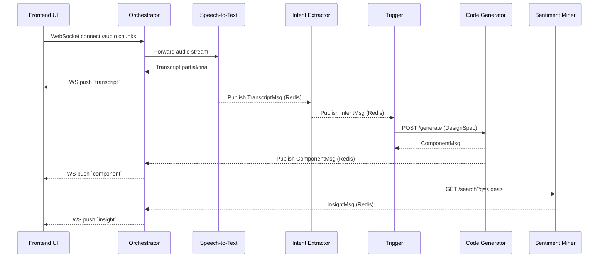
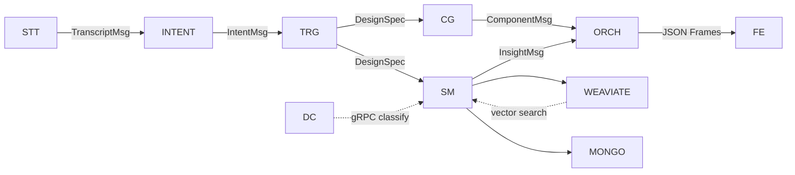
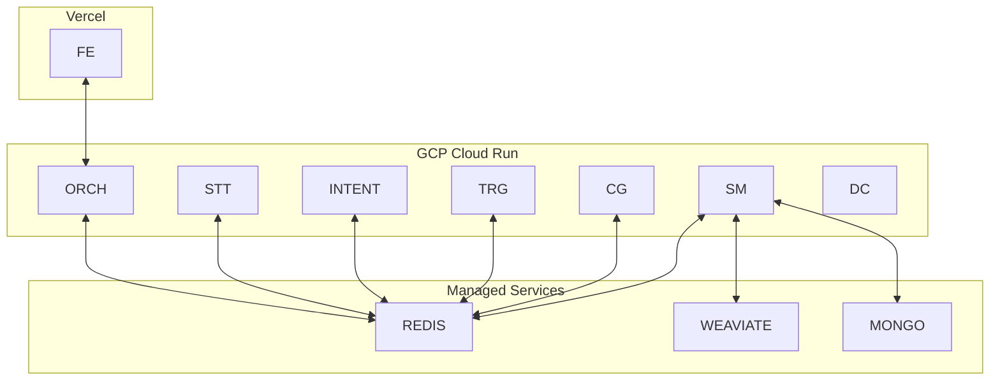
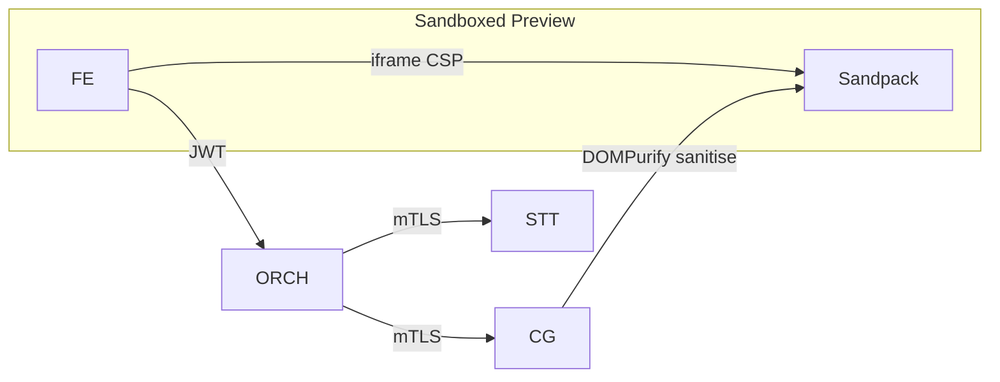

# MockPilot – Architecture Diagram  
*(Docs/ArchitectureDiagram.md – v1.0 2025-05-31)*  

This document visualises all major MockPilot services, their interactions, and the real-time data flow from meeting audio to live design mock-ups and UX insights.

---

## 1. High-Level System Overview

```mermaid
flowchart TB
    subgraph Meeting Session
        A1[Meeting Audio<br/>(WebSocket)]
    end
    subgraph Processing
        STT[Speech-to-Text<br/>(Whisper WS)]
        INTENT[Intent Extractor]
        TRG[Trigger / Debounce]
        MAP[Design Mapper]
        CG[Code Generator]
        SM[Sentiment Miner]
        DC[Demographic Classifier]
    end
    subgraph Messaging Bus
        REDIS[(Redis Pub/Sub)]
    end
    subgraph Presentation
        ORCH[Orchestrator API<br/>(FastAPI WS)]
        FE[Frontend Dashboard<br/>React + Sandpack]
    end
    subgraph Data Stores
        WEAVIATE[(Weaviate Vector DB)]
        MONGO[(MongoDB Atlas)]
    end

    A1 -->|PCM / Opus| STT
    STT -- Transcript JSON --> REDIS
    REDIS -- subscribe --> INTENT
    INTENT -- Intent JSON --> REDIS
    REDIS -- subscribe --> TRG
    TRG -->|DesignSpec| MAP
    MAP --> TRG
    TRG -->|DesignSpec| CG
    CG -- Component JSON --> REDIS
    TRG -->|Query| SM
    SM -->|Insight JSON| REDIS
    SM --> WEAVIATE
    SM --> MONGO
    SM --> DC
    DC --> SM
    REDIS -- subscribe --> ORCH
    ORCH <--> FE
```

---

## 2. Real-Time Sequence (Happy Path)



---

## 3. Detailed Component Interaction



**Legend**  
• Solid arrow = primary data path  
• Dashed arrow = auxiliary / async request  

---

## 4. Pub/Sub Channels

| Channel | Producer | Consumers | Payload |
|---------|----------|-----------|---------|
| `transcripts` | Speech-to-Text | Intent, Orchestrator | `TranscriptMsg` |
| `intents` | Intent Extractor | Trigger, Orchestrator | `IntentMsg` |
| `design_specs` | Trigger | Code Generator, Sentiment Miner | `DesignSpec` |
| `components` | Code Generator | Orchestrator | `ComponentMsg` |
| `insights` | Sentiment Miner | Orchestrator | `InsightMsg` |

---

## 5. Deployment Topology



All services publish heartbeat pings (`service:<name>:alive → "pong"`) every 10 s; Prometheus scrapes these for uptime dashboards.

---

## 6. Security & Compliance Highlights



- JWT: `aud="mockpilot"`, HS256 during hackathon.  
- mTLS: intra-cluster certs baked into Docker images.  
- Generated JSX passes Babel static analysis and DOMPurify before render.

---

## 7. Extensibility Hooks

1. **`post_generate(component)`** in CodeGen – inject lint, ESLint, or AI critic.  
2. **`on_insight(insight_json)`** in Frontend – plugin slots for custom visualisations.  
3. **`design_mapper.yaml`** reload – hot-swap brand-style mappings without redeploy.

---

_Last updated: 2025-05-31 — version 1.0_
